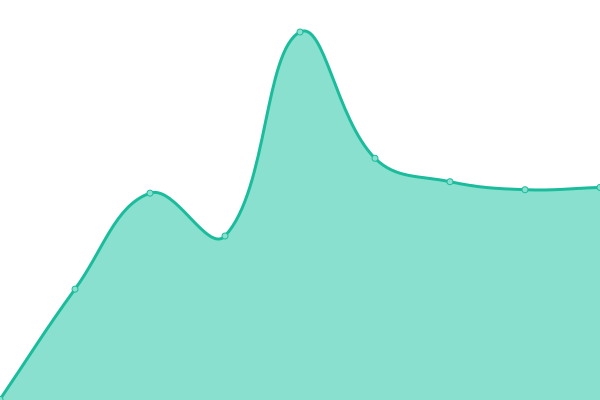

# [📈 Live Status](https://status.meson.network): <!--live status--> **🟧 Partial outage**

This repository contains the open-source uptime monitor and status page for [daqNext](https://meson.network), powered by [Upptime](https://github.com/upptime/upptime).

With [Upptime](https://upptime.js.org), you can get your own unlimited and free uptime monitor and status page, powered entirely by a GitHub repository. We use [Issues](https://github.com/daqnext/status/issues) as incident reports, [Actions](https://github.com/daqnext/status/actions) as uptime monitors, and [Pages](https://status.meson.network) for the status page.

<!--start: status pages-->
<!-- This summary is generated by Upptime (https://github.com/upptime/upptime) -->
<!-- Do not edit this manually, your changes will be overwritten -->
<!-- prettier-ignore -->
| URL | Status | History | Response Time | Uptime |
| --- | ------ | ------- | ------------- | ------ |
|  [Meson Network](https://meson.network) | 🟥 Down | [meson-network.yml](https://github.com/daqnext/status/commits/HEAD/history/meson-network.yml) | 

 489ms
     
 | 

<a href="https://status.meson.network/history/meson-network">100.00%</a>
    

|  [MCDN](https://m-cdn.io) | 🟥 Down | [mcdn.yml](https://github.com/daqnext/status/commits/HEAD/history/mcdn.yml) | 

 257ms
     
 | 

<a href="https://status.meson.network/history/mcdn">100.00%</a>
    

|  [ColdCDN](https://coldcdn.com) | 🟩 Up | [cold-cdn.yml](https://github.com/daqnext/status/commits/HEAD/history/cold-cdn.yml) | 

 259ms
     
 | 

<a href="https://status.meson.network/history/cold-cdn">100.00%</a>
    

|  [Meson Docs](https://docs.meson.network) | 🟥 Down | [meson-docs.yml](https://github.com/daqnext/status/commits/HEAD/history/meson-docs.yml) | 

 394ms
     
 | 

<a href="https://status.meson.network/history/meson-docs">100.00%</a>
    

|  [Meson Blog](https://blog.meson.network) | 🟥 Down | [meson-blog.yml](https://github.com/daqnext/status/commits/HEAD/history/meson-blog.yml) | 

 320ms
     
 | 

<a href="https://status.meson.network/history/meson-blog">100.00%</a>
    

|  [Content2049](https://content2049.meson.network) | 🟥 Down | [content2049.yml](https://github.com/daqnext/status/commits/HEAD/history/content2049.yml) | 

 558ms
     
 | 

<a href="https://status.meson.network/history/content2049">100.00%</a>
    

<!--end: status pages-->

[**Visit our status website →**](https://status.meson.network)

## 📄 License

- Powered by: [Upptime](https://github.com/upptime/upptime)
- Code: [MIT](./LICENSE) © [daqNext](https://meson.network)
- Data in the `./history` directory: [Open Database License](https://opendatacommons.org/licenses/odbl/1-0/)
